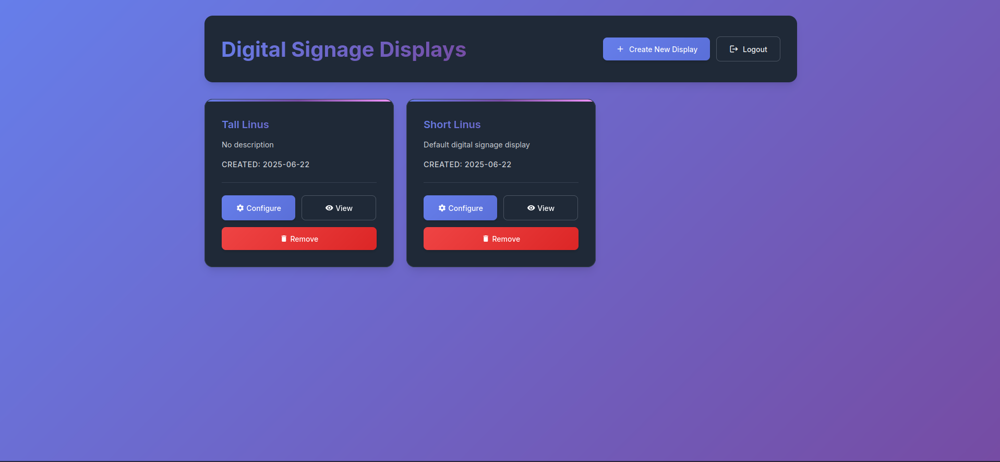
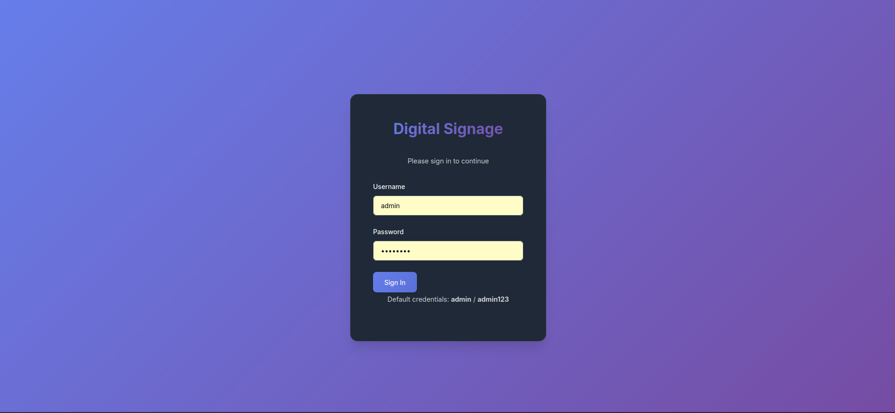
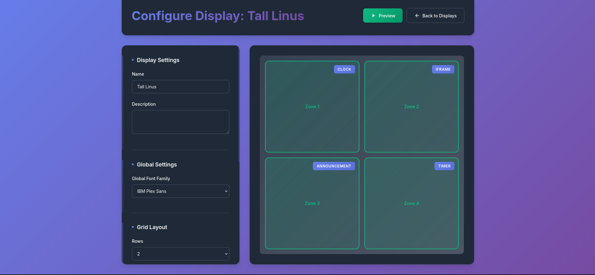
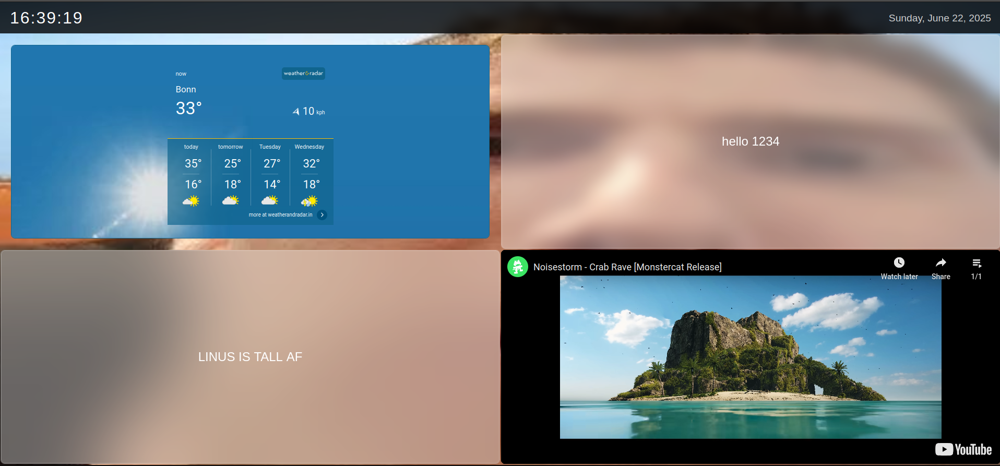

# Digital Signage Application

A modern, browser-based digital signage application built with Python Flask and vanilla JavaScript. Create dynamic displays, information boards, and digital signs with beautiful typography and a polished admin interface.


## Screenshots

### Admin Dashboard


### Login Screen


### Display Configuration


### Player View


## 🌟 Features

### Core Functionality
- **🎯 Browser-based Display**: Full-screen player runs entirely in web browser
- **📅 Always-visible Top Bar**: Shows current date and time
- **🎛️ Configurable Grid Layout**: Support for 2x2, 3x2, 3x3, 4x4 grids
- **🔧 Multiple Widget Types**:
  - 🕒 Real-time Clock (analog & digital)
  - ⏱️ Countdown Timer
  - 📢 Text Announcements with rich formatting
  - 🌐 iframe Embeds for web content
  - 📰 RSS Feed Display
- **🎨 Customizable Backgrounds**: Colors or uploaded images
- **👁️ Opacity Controls**: Per-zone transparency settings
- **🔤 Typography**: Wide selection of Google Fonts (Inter, Work Sans, Manrope, and more)

### Management Features
- **🔐 Secure Authentication**: Modern login system
- **📱 Multiple Display Support**: Manage unlimited displays
- **💾 Persistent Storage**: SQLite database for configurations
- **📤 File Upload**: Background image uploads with validation
- **⚡ Live Preview**: Real-time configuration preview
- **🗑️ Display Management**: Add, edit, and remove displays with confirmation
- **✨ Modern UI**: Polished admin interface with Material Design icons

### Technical Features
- **🐳 Docker Ready**: Dockerfile and docker-compose included
- **🚀 Easy Deployment**: Startup scripts for Windows, Linux, and macOS
- **📱 Responsive Design**: Works on all screen sizes
- **🔄 Auto-refresh**: Automatic content updates every 30 seconds
- **🎨 CSS Variables**: Modern styling with custom properties
- **📦 No Node.js**: Pure Python backend, vanilla JavaScript frontend

## 🚀 Quick Start

### Prerequisites
- Python 3.8 or higher
- Modern web browser (Chrome, Firefox, Safari, Edge)

### Method 1: Quick Setup (Recommended)

#### Linux/macOS
```bash
# Clone the repository
git clone https://github.com/AiryAir/signage2
cd signage2

# Run quick setup (includes admin account configuration)
./setup.sh

# Start the application
./start.sh
```

#### Windows (PowerShell)
```powershell
# Clone the repository
git clone https://github.com/AiryAir/signage2
cd signage2

# Run quick setup (includes admin account configuration)
.\setup.ps1

# Start the application
.\start.ps1
```

The setup script will prompt you to create your admin credentials securely.

### Method 2: Manual Setup

#### Linux/macOS
```bash
# Clone the repository
git clone https://github.com/AiryAir/signage2
cd signage2

# Run the startup script
./start.sh

# For production mode
./start.sh prod
```

#### Windows (PowerShell)
```powershell
# Clone the repository  
git clone https://github.com/AiryAir/signage2
cd signage2

# Run the startup script
.\start.ps1

# For production mode
.\start.ps1 prod
```

### Method 3: Step-by-Step Manual Setup
```bash
# Create virtual environment
python3 -m venv venv

# Activate virtual environment
# Linux/macOS:
source venv/bin/activate
# Windows:
venv\Scripts\activate

# Install dependencies
pip install -r requirements.txt

# Run the application
python app.py
```

### Method 4: Docker Deployment

#### Quick Docker Run
```bash
# Build and run with docker-compose
docker-compose up -d

# Or build manually
docker build -t digital-signage .
docker run -p 5000:5000 -v $(pwd)/data:/app/data digital-signage
```

#### Production Docker Setup
```bash
# Run with nginx reverse proxy
docker-compose --profile production up -d
```

## 📖 Usage Guide

### First Time Setup

1. **Access the Application**
   - Open your browser and go to `http://localhost:5000`
   - Login with the credentials you set during setup

2. **Create Your First Display**
   - Click "Create New Display"
   - Give it a name and description
   - Click "Create"

3. **Configure Your Display**
   - Click "Configure" on your display
   - Choose grid layout (rows/columns)
   - Set background color or upload image
   - Click on zones to configure content

### Zone Configuration

Each zone in your grid layout can contain different types of content:

#### 🕒 Clock Widget
- **Digital Clock**: Shows current time and date with customizable format
- **Analog Clock**: Classic circular clock face
- **Auto-update**: Updates every second
- **Timezone Support**: Displays local time
- **Font Customization**: Choose from extensive Google Fonts collection

#### ⏱️ Timer Widget
- **Countdown Timer**: Set duration in minutes
- **Visual Progress**: Animated countdown display
- **Alert System**: Visual notification when timer reaches zero
- **Auto-restart**: Automatically begins new countdown cycle
- **Custom Styling**: Configurable colors and fonts

#### 📢 Announcement Widget
- **Rich Text**: Display custom text messages with formatting
- **Multi-line Support**: Perfect for longer announcements
- **Font Selection**: Choose from Inter, Work Sans, Manrope, and many more Google Fonts
- **Color Customization**: Set text and background colors
- **Scrolling Text**: Auto-scroll for longer content

#### 🌐 iframe Widget
- **Web Content Embedding**: Display any web page or dashboard
- **Flexible Input**: Enter full iframe HTML code or just URL
- **Auto-sizing**: Responsive content fitting
- **Use Cases**: Dashboards, weather displays, news sites, video streams
- **Security**: Sandboxed iframe execution

#### 📰 RSS Feed Widget
- **News Feeds**: Display live RSS/Atom feeds
- **Auto-refresh**: Updates every 10 minutes
- **Rich Display**: Shows titles, descriptions, and timestamps
- **Error Handling**: Graceful fallback for feed issues
- **Customizable**: Control number of items and display format

### Font System

The application includes an extensive selection of Google Fonts organized by category:

- **Sans-serif**: Inter, Work Sans, Manrope, Source Sans Pro, Open Sans
- **Serif**: Playfair Display, Merriweather, Crimson Text, Libre Baskerville
- **Monospace**: JetBrains Mono, Source Code Pro, Space Mono
- **Display**: Oswald, Montserrat, Roboto Condensed

Each zone can have its own font selection for maximum customization.

### Display Management

#### Creating Displays
1. **Navigate to Admin Dashboard**: Click "Displays" or go to `/displays`
2. **Add New Display**: Click the "Create New Display" button
3. **Enter Details**: Provide name and description
4. **Configure Layout**: Choose grid size and customize zones

#### Editing Displays
1. **Select Display**: Click "Configure" on any display card
2. **Modify Settings**: Change layout, background, and zone content
3. **Preview Changes**: See real-time preview as you edit
4. **Save**: Click "Save Configuration" to apply changes

#### Removing Displays
1. **Delete Display**: Click the "Remove Display" button on any display card
2. **Confirm Deletion**: A modal will ask for confirmation
3. **Permanent Removal**: Display and all its configuration will be deleted

#### Multiple Displays
- **Unlimited Displays**: Create as many displays as needed
- **Unique Configurations**: Each display has independent settings
- **Easy Management**: Modern card-based interface with search and filtering
- **Display URLs**: Each display gets a unique URL for player access

#### Background Options
- **Solid Colors**: Choose from color picker or enter hex values
- **Image Upload**: Upload custom background images (PNG, JPG, GIF, WebP)
- **File Management**: Uploaded images are stored in `/static/uploads/`
- **Responsive**: Backgrounds automatically scale to fit display

#### Grid Layouts
- **Flexible Grids**: 2x2, 3x2, 3x3, 4x4 supported
- **Zone Customization**: Each grid cell can be individually configured
- **Responsive Design**: Layouts adapt to different screen sizes
- **Visual Editor**: Click zones to configure content

#### Opacity and Styling
- **Zone Transparency**: Adjust opacity for layered effects
- **Global Settings**: Apply font and color settings across zones
- **Per-zone Override**: Individual zones can have custom styling
- **Modern UI**: Material Design-inspired interface with icons

## 🎨 Customization

### Styling
Edit `static/css/player.css` to customize:
- Colors and fonts
- Animation effects
- Zone layouts
- Widget appearances

### Adding New Widget Types
1. Add new type to zone configuration
2. Implement widget creation in `player.js`
3. Add corresponding styles in `player.css`
4. Update configuration UI

### RSS Feed Customization
- Modify RSS display format in `player.js`
- Adjust refresh intervals
- Customize error handling

## Security & Authentication

### Admin Account Setup
During the initial setup process (`./setup.sh` or `.\setup.ps1`), you'll be prompted to create your admin credentials:
- **Username**: Choose your admin username (default: admin)
- **Password**: Set a secure password (minimum 4 characters)

### Password Reset
If you need to reset your admin password later, use the password reset utility:

```bash
# Linux/macOS
python3 reset-password.py

# Windows
python reset-password.py
```

This utility will:
- Find your existing database
- Show current users
- Allow you to reset any user's password
- Securely prompt for new credentials

### Production Security
For production deployments:
1. **Use Strong Passwords**: Ensure admin passwords are complex and unique
2. **Set SECRET_KEY**: Use a secure secret key for session management
3. **Enable HTTPS**: Configure SSL/TLS certificates
4. **Network Security**: Restrict admin access to trusted networks
5. **Regular Updates**: Keep the application and dependencies updated

## �🔧 Configuration Files

### Application Settings
The main configuration is stored in the SQLite database (`data/signage.db`). No manual configuration files needed for basic operation.

### Environment Variables
```bash
# Development
export FLASK_ENV=development
export SECRET_KEY=your-secret-key-for-sessions

# Production
export FLASK_ENV=production
export SECRET_KEY=generate-a-strong-random-key
export DATABASE_FILE=/path/to/custom/database.db
```

### File Structure
```
signage2/
├── app.py                    # Main Flask application
├── requirements.txt          # Python dependencies
├── Dockerfile               # Docker configuration
├── docker-compose.yml       # Docker Compose setup
├── nginx.conf              # nginx configuration for production
├── setup.sh                # Quick setup script with admin account config (Linux/macOS)
├── setup.ps1               # Quick setup script with admin account config (Windows)
├── start.sh                # Application startup script (Linux/macOS)
├── start.ps1               # Application startup script (Windows)
├── reset-password.py       # Admin password reset utility
├── .gitignore              # Git ignore patterns
├── README.md               # This documentation
├── templates/              # Jinja2 HTML templates
│   ├── base.html           # Base template with common layout
│   ├── login.html          # Login page
│   ├── displays.html       # Display management dashboard
│   ├── display_config.html # Display configuration editor
│   └── player.html         # Player display template
├── static/                 # Static web assets
│   ├── css/
│   │   ├── style.css       # Admin interface styles (modern UI)
│   │   └── player.css      # Player display styles
│   ├── js/
│   │   ├── app.js          # Common utilities and API wrapper
│   │   ├── config.js       # Configuration interface logic
│   │   └── player.js       # Display player runtime
│   └── uploads/            # User-uploaded background images
├── data/                   # Application data (auto-created)
│   └── signage.db          # SQLite database
├── screenshots/            # Documentation screenshots
│   ├── admin-dashboard.png
│   ├── display-config.png
│   ├── login-screen.png
│   ├── player-view.png
│   └── zone-config.png
└── venv/                   # Python virtual environment (if used)
```

### Database Schema
The SQLite database automatically creates these tables:
- `displays`: Display configurations and metadata
- `zones`: Individual zone content and styling
- `uploads`: File upload tracking

## 🐳 Docker Deployment

### Development
```bash
docker-compose up
```

### Production with nginx
```bash
docker-compose --profile production up -d
```

### Environment Variables
Create `.env` file:
```env
SECRET_KEY=your-super-secret-key-here
FLASK_ENV=production
```

### Persistent Data
Data persists in:
- `./data/` - Database files
- `./static/uploads/` - Uploaded images

## 🔒 Security Considerations

### Production Deployment
1. **Set Strong Admin Credentials**
   - Use the setup script to create secure credentials
   - Run `python3 reset-password.py` to change passwords anytime

2. **Set Secret Key**
   ```bash
   export SECRET_KEY="your-random-secret-key"
   ```

3. **Use HTTPS**
   - Configure reverse proxy (nginx)
   - Use SSL certificates

4. **Firewall Configuration**
   - Restrict access to admin interface
   - Allow player access from display devices

### Network Security
- Admin interface: Restrict to management network
- Player displays: Can be on public network
- Consider VPN for remote management

## 🛠️ Troubleshooting

### Common Issues

#### "Module not found" Error
```bash
# Ensure virtual environment is activated
source venv/bin/activate  # Linux/macOS
venv\Scripts\activate     # Windows

# Reinstall dependencies
pip install -r requirements.txt
```

#### Port 5000 Already in Use
```bash
# Kill existing process
lsof -ti:5000 | xargs kill -9  # Linux/macOS

# Or change port in app.py
app.run(host='0.0.0.0', port=5001)
```

#### RSS Feeds Not Loading
- Check feed URL is accessible
- Verify feed format (RSS/Atom)
- Check network connectivity
- Review browser console for errors

#### Upload Issues
- Check file permissions on `static/uploads/`
- Verify file size limits
- Ensure supported image formats

#### Forgot Admin Password
```bash
# Use the password reset utility
python3 reset-password.py

# Or recreate the database (will lose all data)
rm -f data/signage.db signage.db
./setup.sh
```

### Debug Mode
Run with debug enabled:
```bash
export FLASK_ENV=development
python app.py
```

### Logs
Check application logs:
```bash
# Docker logs
docker-compose logs signage

# Direct execution logs
# Logs appear in terminal
```

## 🔄 Updates and Maintenance

### Updating the Application
1. Stop the application
2. Backup database: `cp signage.db signage.db.backup`
3. Update code
4. Restart application

### Database Backup
```bash
# Backup
cp data/signage.db data/signage.db.$(date +%Y%m%d)

# Restore
cp data/signage.db.backup data/signage.db
```

### Clearing Cache
- RSS feeds: Restart application
- Uploaded images: Clear `static/uploads/`
- Configuration: Reset database

## 📄 API Reference

### Authentication Endpoints
- `POST /login` - User authentication
  ```json
  {
    "username": "admin",
    "password": "admin123"
  }
  ```
- `GET /logout` - User logout
- `GET /admin` - Redirect to admin dashboard

### Display Management API
- `GET /api/displays` - List all displays
- `GET /api/display/{id}` - Get display configuration
- `POST /api/display` - Create new display
  ```json
  {
    "name": "Display Name",
    "description": "Display Description",
    "rows": 2,
    "cols": 2,
    "background_color": "#ffffff",
    "background_image": null
  }
  ```
- `PUT /api/display/{id}` - Update display configuration
- `DELETE /api/display/{id}` - Delete display (with confirmation)

### Zone Management API
- `GET /api/display/{id}/zones` - Get zones for display
- `PUT /api/zone/{id}` - Update zone content
  ```json
  {
    "content_type": "clock|timer|announcement|iframe|rss",
    "content": "Zone-specific content",
    "font_family": "Inter",
    "font_size": "16px",
    "color": "#000000",
    "opacity": 1.0
  }
  ```

### Utility Endpoints
- `GET /api/time` - Current server time (JSON)
- `GET /api/rss?url={feed_url}` - RSS feed proxy with CORS headers
- `POST /api/upload` - File upload for background images
  - Supports: PNG, JPG, JPEG, GIF, WebP
  - Max size: 10MB
  - Returns: `{"url": "/static/uploads/filename.ext"}`

### Player Endpoints
- `GET /player/{id}` - Display player page
- `GET /` - Login page or redirect to displays

## 📸 Screenshots

The application includes screenshots in the `screenshots/` directory showing:
- Login screen
- Admin dashboard  
- Display configuration
- Player view

These screenshots demonstrate the modern UI and functionality of the application.

## 🤝 Contributing

### Development Setup
1. Fork the repository
2. Create feature branch
3. Make changes
4. Test thoroughly
5. Submit pull request

### Coding Standards
- Follow PEP 8 for Python
- Use ESLint for JavaScript
- Document new features
- Add tests for new functionality

## 📋 Changelog

### Version 2.0.0 (Current)
- **Enhanced Typography**: Added extensive Google Fonts collection (Inter, Work Sans, Manrope, etc.)
- **Modern Admin UI**: Complete redesign with Material Design inspiration
  - CSS variables for consistent theming
  - Gradient backgrounds and modern button styles
  - Improved responsive design
  - Better form styling with white text
- **Display Management**: Added "Remove Display" functionality with confirmation modal
- **Material Icons**: Integrated Material Design icons throughout the interface
- **Improved UX**: Better spacing, layouts, and visual hierarchy
- **Bug Fixes**: Fixed admin 404 redirect, form field text colors
- **Code Cleanup**: Removed unnecessary debug files
- **Documentation**: Comprehensive README with screenshots and setup guide

### Version 1.0.0
- Initial release
- Basic grid layout system (2x2, 3x2, 3x3, 4x4)
- Widget support (clock, timer, announcement, iframe, RSS)
- Background customization (colors and images)
- Multi-display management
- SQLite database backend
- Flask web framework
- Docker support with docker-compose
- Cross-platform startup scripts (Windows, Linux, macOS)
- Basic authentication system
- File upload for background images

## 📝 License

This project is open source. Feel free to use, modify, and distribute.

**Happy Digital Signage! 🎉**
